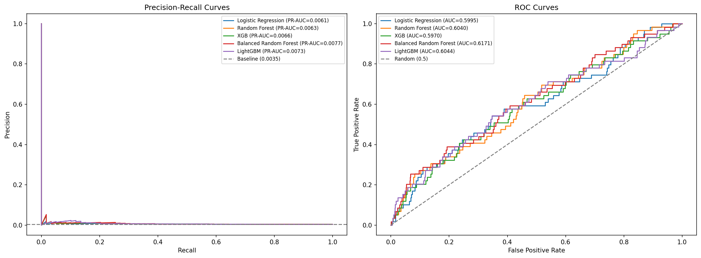
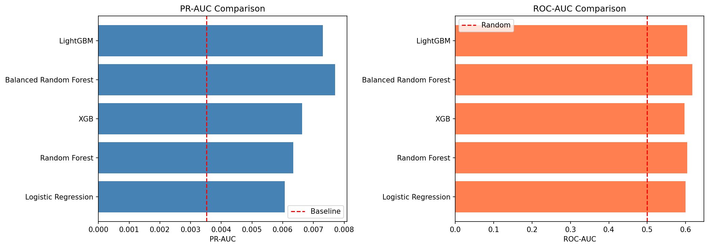
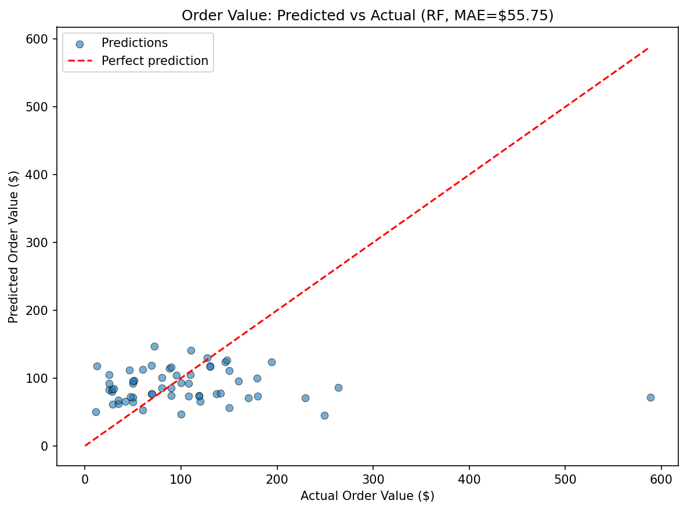
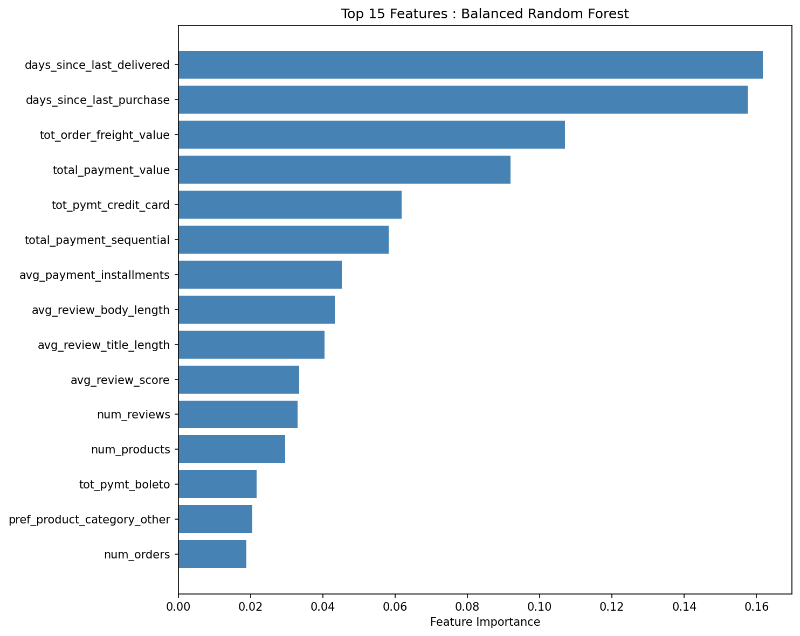
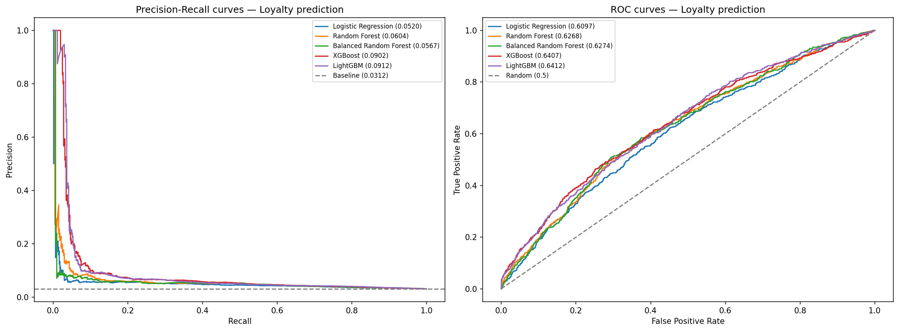
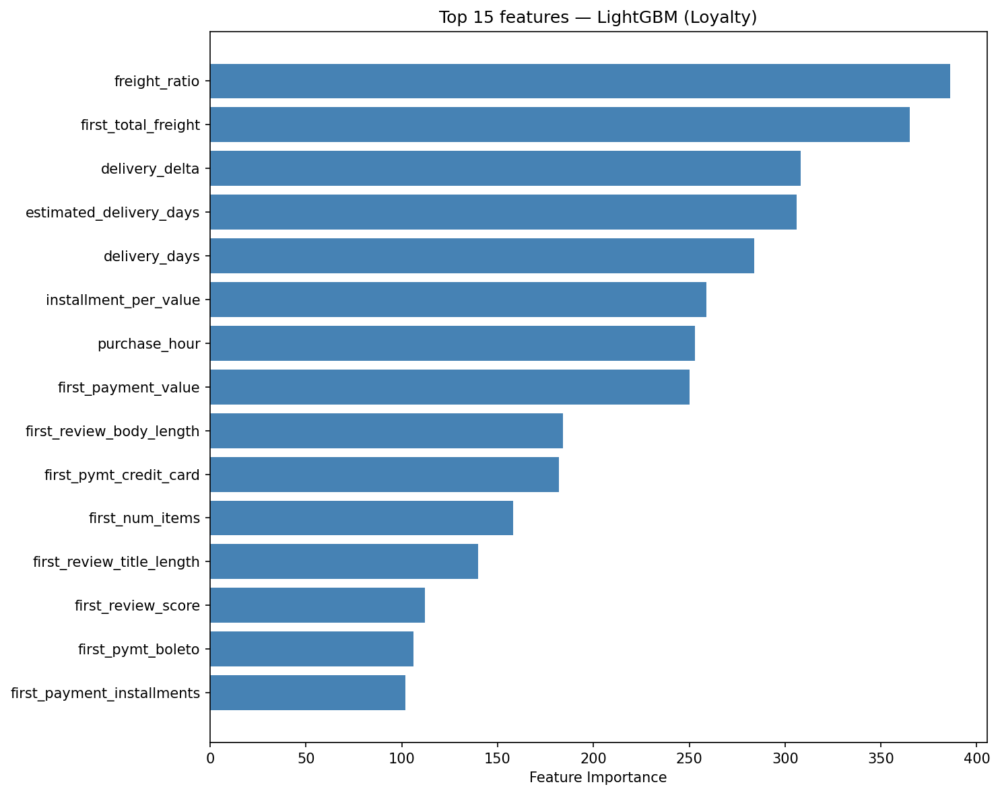
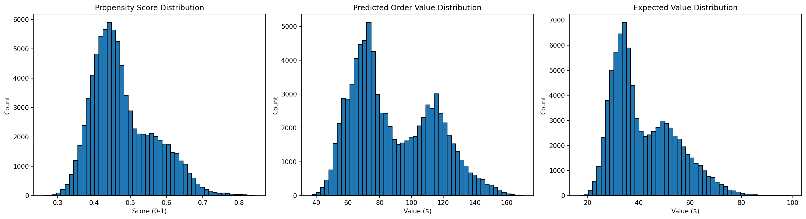
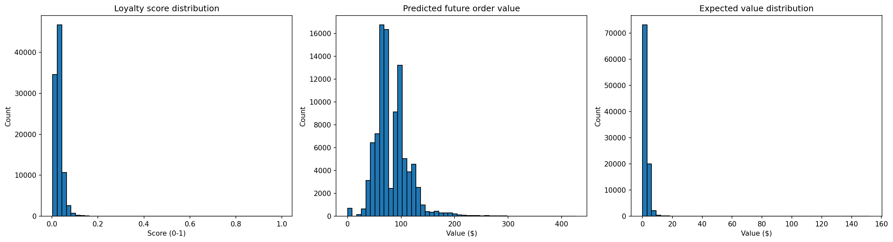

# Predicting Customer Purchase Propensity & Order Value

## Two Interpretations of One Problem

The assessment asks: *"Predict a user's propensity to place an order and their expected order value."* This can be interpreted two ways:

**Interpretation 1 - Snapshot-based propensity:** Given everything we know about a customer's history up to a point in time, will they purchase in the next 90 days? This is a time-windowed prediction — realistic for production ad targeting where you score customers monthly.

**Interpretation 2 - Loyalty prediction:** Given a customer's very first purchase, will they ever come back? This reframes the problem as identifying repeat buyers at the moment of acquisition — critical for customer lifetime value estimation.

Both interpretations are valid and complementary. I implemented both as separate pipelines:

| Aspect | Approach 1: Propensity | Approach 2: Loyalty |
|---|---|---|
| Question | Will they buy in the next 90 days? | Will they ever return? |
| Features | Full purchase history (all orders) | First order only |
| Target | Ordered after cutoff? (binary) | More than 1 lifetime order? (binary) |
| Positive rate | 0.35% (293 users) | 3.12% (2,997 users) |
| Use case | Short-term campaign targeting | Lifetime value identification |
| Value target | Avg order value in target window | Avg future order value (excl. first) |

---

## Dataset

The [Brazilian E-Commerce Public Dataset by Olist](https://www.kaggle.com/datasets/olistbr/brazilian-ecommerce) contains ~100K orders from 2016–2018 across 11 CSV files.

**Tables used (7):**

| Table | Rows | Description |
|---|---|---|
| `olist_customers_dataset` | 99,441 | Customer demographics and location |
| `olist_orders_dataset` | 99,441 | Order-level data with timestamps and status |
| `olist_order_items_dataset` | 112,650 | Item-level price and freight per order |
| `olist_order_payments_dataset` | 103,886 | Payment method, installments, value |
| `olist_order_reviews_dataset` | 99,224 | Review scores and text |
| `olist_products_dataset` | 32,951 | Product category and attributes |
| `product_category_name_translation` | 71 | Portuguese to English category mapping |

**Tables excluded (4):** Geolocation (redundant with customer city/state), sellers (low signal), closed deals and marketing leads (B2B seller acquisition funnel, not customer-facing).

---

## Pipeline Architecture

```
01_data_exploration.ipynb        → Schema, quality checks, profiling reports

02A_feature_engineering.ipynb    → Approach 1: Temporal features (history-based)
03A_modelling.ipynb              → Approach 1: EDA + model training + evaluation
04A_inference.ipynb              → Approach 1: Score all customers

02B_feature_engineering.ipynb    → Approach 2: First-order features (loyalty-based)
03B_modelling_loyalty.ipynb      → Approach 2: Model training + evaluation
04B_inference_loyalty.ipynb      → Approach 2: Score all customers
```

---

## Approach 1: Snapshot-Based Propensity

### Temporal Split

- **Feature window:** 2016-09-04 to 2018-07-01 (22 months of history)
- **Target window:** 2018-07-01 to 2018-10-01 (90 days)
- A 30-day window was initially tested but yielded only 9 qualifying orders (all canceled). The 90-day window provides 293 repeat customers.

### Feature Engineering (33 features across 6 groups)

| Group | Count | Description |
|---|---|---|
| Order count & status | 10 | Total orders + count pivoted by each order status |
| Monetary & payment | 7 | Total spend, installments, value split by payment type |
| Item & product | 7 | Product count, seller diversity, price, freight |
| Review engagement | 4 | Review count, score, title length, body length |
| Recency | 4 | Days since last purchase, shipment, delivery, review |
| Preferences | 2 | Preferred product category, preferred payment method |

After correlation filtering (|r| > 0.7), 7 features removed. Categoricals one-hot encoded → **40 model-ready features**.

Full documentation: [`data_reports/Feature_Engineering.xlsx`](data_reports/Feature_Engineering.xlsx)

### Classification Results

| Model | ROC-AUC | PR-AUC |
|---|---|---|
| Logistic Regression | 0.5995 | 0.0061 |
| Random Forest | 0.6040 | 0.0063 |
| XGBoost | 0.5970 | 0.0066 |
| **Balanced Random Forest** | **0.6171** | **0.0077** |
| LightGBM | 0.6044 | 0.0073 |





### Regression Results (Order Value)

| Model | MAE | RMSE |
|---|---|---|
| Ridge | $60.24 | $94.38 |
| **Random Forest** | **$55.75** | **$91.80** |
| XGBoost | $55.78 | $92.14 |



### Top Features (Balanced Random Forest)



Recency dominates — `days_since_last_delivered` and `days_since_last_purchase` are #1 and #2. Payment value and freight follow. This aligns with established RFM (Recency, Frequency, Monetary) frameworks.

### Why Performance Is Limited

Five different model architectures converge to similar PR-AUC (~0.006–0.008), confirming the signal ceiling is in the data, not the model. With 97% of customers having exactly one order, their feature profiles are nearly identical regardless of whether they return. Only 293 positive examples in a 90-day window provides insufficient signal for discrimination.

---

## Approach 2: Loyalty Prediction

### Problem Reframing

Instead of predicting within a time window, we ask: **at the moment of first purchase, can we identify who will become a repeat buyer?** This gives us 2,997 positive examples (3.12%) — 10x more signal.

### Feature Engineering (34 features from first order only)

| Group | Features | Description |
|---|---|---|
| Payment behavior | 8 | Value, installments, payment type split, sequential count |
| Order composition | 4 | Item count, seller count, total freight, total price |
| Review engagement | 3 | Score, title length, body length |
| Delivery experience | 3 | Delivery days, estimated days, delivery delta (early vs late) |
| Purchase context | 3 | Hour of day, day of week, is_delivered |
| Ratio features | 3 | Freight ratio, price per item, installment per value |
| Product category | 11 | One-hot encoded (top 10 + other) |

### Classification Results

| Model | ROC-AUC | PR-AUC | F1 | Precision | Recall |
|---|---|---|---|---|---|
| Logistic Regression | 0.6097 | 0.0520 | 0.0933 | 0.0577 | 0.2437 |
| Random Forest | 0.6268 | 0.0604 | 0.0947 | 0.0609 | 0.2137 |
| Balanced Random Forest | 0.6274 | 0.0567 | 0.0967 | 0.0537 | 0.4825 |
| XGBoost | 0.6407 | 0.0902 | 0.1132 | 0.0897 | 0.1536 |
| **LightGBM** | **0.6412** | **0.0912** | **0.1106** | **0.0920** | **0.1386** |



### Regression Results (Future Order Value)

| Model | MAE | RMSE |
|---|---|---|
| Ridge | $72.38 | $141.82 |
| **Random Forest** | **$67.13** | **$136.89** |
| XGBoost | $68.06 | $139.65 |

### Top Features (LightGBM)



Key insights:
- **Freight ratio** (#1) — shipping cost relative to order value is the strongest loyalty signal
- **Delivery experience** features are top 5 — late deliveries reduce repeat likelihood
- **Ratio features** outperform raw values — behavioral intensity matters more than scale
- **Purchase hour** is predictive — when customers shop correlates with loyalty patterns

---

## Approach Comparison

| Metric | Approach 1 (Propensity) | Approach 2 (Loyalty) |
|---|---|---|
| Best PR-AUC | 0.0077 | **0.0912** (12x improvement) |
| Best ROC-AUC | 0.6171 | **0.6412** |
| Best classification model | Balanced Random Forest | LightGBM |
| Regression MAE | **$55.75** | $67.13 |
| Best regression model | Random Forest | Random Forest |
| Positive examples | 293 | 2,997 |

**Approach 2 dramatically outperforms on classification** due to 10x more positive examples and richer first-order features (delivery experience, ratio features). **Approach 1 has lower regression MAE** because it predicts on a narrower, more recent time window.

In a production system, both models would be deployed together — Approach 2 identifies WHO is likely loyal at acquisition, Approach 1 tells you WHEN to re-engage them.

---

## Inference Pipeline

Both approaches produce a ranked customer list with:
- **Propensity/Loyalty score** — probability (0–1) of purchase/repeat
- **Predicted order value** — expected spend if they convert
- **Expected value** — score × predicted value — the final ranking metric for ad targeting




---

## Key Takeaways

1. **Problem framing matters more than model selection.** Reframing from temporal propensity to loyalty prediction yielded 12x improvement in PR-AUC — no amount of hyperparameter tuning on Approach 1 could match this.

2. **Feature engineering drives performance.** Ratio features (freight_ratio, installment_per_value) and delivery experience features provided the most predictive lift in Approach 2. Raw transactional values alone are insufficient.

3. **Class imbalance is a data problem, not a model problem.** Five different model architectures converged to similar performance in Approach 1. The solution was more positive examples (Approach 2), not more complex models.

4. **Recency and delivery experience are the strongest signals.** Across both approaches, how recently a customer interacted and whether their order was delivered on time are the most important predictors.

---

## Repository Structure

```
SCOWTT/
├── datasets/                              # Raw CSVs (not committed)
├── processed/                             # Aggregated modelling datasets
│   ├── modelling_dataset.csv              # Approach 1 features + targets
│   ├── user_features.csv                  # Approach 1 features only
│   └── loyalty_modelling_dataset.csv      # Approach 2 features + targets
├── notebooks/
│   ├── 01_data_exploration.ipynb          # Schema, quality, profiling
│   ├── 02A_feature_engineering.ipynb      # Approach 1: temporal features
│   ├── 02B_feature_engineering.ipynb      # Approach 2: first-order features
│   ├── 03A_modelling.ipynb               # Approach 1: train + evaluate
│   ├── 03B_modelling_loyalty.ipynb       # Approach 2: train + evaluate
│   ├── 04A_inference.ipynb               # Approach 1: score customers
│   └── 04B_inference_loyalty.ipynb       # Approach 2: score customers
├── data_reports/
│   ├── Feature_Engineering.xlsx           # Feature documentation
│   └── *_report.html                     # ydata-profiling reports
├── outputs/
│   ├── best_propensity_model.pkl
│   ├── best_value_model.pkl
│   ├── best_loyalty_model.pkl
│   ├── best_loyalty_value_model.pkl
│   ├── scaler.pkl
│   ├── customer_scores.csv               # Approach 1 scored output
│   ├── loyalty_customer_scores.csv       # Approach 2 scored output
│   └── *.png                             # All evaluation plots
├── pyproject.toml
├── uv.lock
├── .gitignore
└── README.md
```

---

## Setup

1. Install [uv](https://docs.astral.sh/uv/):
   ```bash
   curl -LsSf https://astral.sh/uv/install.sh | sh
   ```

2. Clone and install:
   ```bash
   git clone https://github.com/ujwal-jibhkate/SCOWTT-Customer-Behavior-Prediction.git
   cd SCOWTT-Customer-Behavior-Prediction
   uv sync
   ```

3. Download the [Olist dataset](https://www.kaggle.com/datasets/olistbr/brazilian-ecommerce) and place CSVs in `datasets/`.

4. Run notebooks:
   ```
   Approach 1: 01 → 02A → 03A → 04A
   Approach 2: 01 → 02B → 03B → 04B
   ```

**Python version:** 3.12.12

---

## Future Improvements

- Rolling backtests across multiple monthly snapshots
- Customer x month grain for temporal behavioral shifts
- SHAP-based feature attribution for model interpretability
- Ensemble combining Approach 1 and 2 scores
- Calibration of propensity scores using Platt scaling
- Status-pivoted features (payment value by order status)
- Sentiment analysis on review text using NLP

---

## Use of AI Tools

AI tools (Claude) were used for:
- Guided learning and conceptual understanding of the data science pipeline
- Debugging code and resolving library-specific issues
- Documentation and reporting assistance

All code was written, understood, and validated by the author.